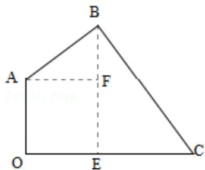
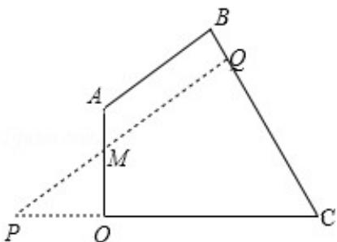

> [!faq]- 2014年江苏高考数学试题及答案解析
>
> > [!success]- **【答案】** ； (2) 设 BC 与 $\odot M$ 切于 Q，延长 QM、CO 交于 P，设 OM=xm，把 PC、PQ 用含有 x 的代数式表示，再结合古桥两端 O 和 A 到该圆上任意一点的距离均不少于 80m 列式求得 x 的范围，得到 x 取最小值时圆的半径最大，即圆形保护区的面积最大.
>
> > [!note]- **【分析】**
> > (1) 在四边形 AOCB 中，过 B 作 BE⊥OC 于 E，过 A 作 AF⊥BE 于 F，设出 AF，然后通过解直角三角形列式求解 BE，进一步得到 CE，然后由勾股定理得
>
> > [!note]- **【解析】**
> > 分析：(1) 在四边形 AOCB 中，过 B 作 BE⊥OC 于 E，过 A 作 AF⊥BE 于 F，设出 AF，然后通过解直角三角形列式求解 BE，进一步得到 CE，然后由勾股定理得
> > 答案；
> >
> > (2) 设 BC 与 $\odot M$ 切于 Q，延长 QM、CO 交于 P，设 OM=xm，把 PC、PQ 用含有 x 的代数式表示，再结合古桥两端 O 和 A 到该圆上任意一点的距离均不少于 80m 列式求得 x 的范围，得到 x 取最小值时圆的半径最大，即圆形保护区的面积最大.
> >
> > 解答: 解: (1) 如图,
> >
> > 
> >
> > 过 B 作 BE⊥OC 于 E，过 A 作 AF⊥BE 于 F，
> > ∵∠ABC=90°，∠BEC=90°，
> > ∴∠ABF=∠BCE，
> > ∴tan∠ABF=tan∠BCO= $\frac{4}{3}$ .
> >
> > 设 AF=4x（m），则 BF=3x（m）.
> >
> > ∵∠AOE=∠AFE=∠OEF=90°，
> > ∴OE=AF=4x（m），EF=AO=60（m），
> > ∴BE=(3x+60)m.
> >
> > ∵tan∠BCO= $\frac{4}{3}$ ,
> >
> > ∴CE= $\frac{3}{4}$ BE=( $\frac{9}{4}$ x+45) (m).
> >
> > ∴OC=(4x+ $\frac{9}{4}$ x+45) (m).
> >
> > $$
> > \therefore 4 x + \frac {9}{4} x + 4 5 = 1 7 0,
> > $$
> >
> > 解得：x=20.
> >
> > $\therefore BE=120m,\ CE=90m,$
> >
> > 则 BC=150m;
> >
> > (2) 如图，
> >
> > 
> >
> > 设 BC 与 $\odot M$ 切于 Q，延长 QM、CO 交于 P，
> >
> > $\because \angle POM = \angle PQC = 90^{\circ},$
> >
> > $$
> > \therefore \angle \mathrm{PMO} = \angle \mathrm{BCO}.
> > $$
> >
> > 设 $\mathrm{OM} = \mathrm{x}\mathrm{m}$ ，则 $\mathrm{OP} = \frac{4}{3}\mathrm{x}\mathrm{m}$ ， $\mathrm{PM} = \frac{5}{3}\mathrm{x}\mathrm{m}$
> >
> > $\therefore \mathrm{PC} = \left(\frac{4}{3}\mathbf{x} + 170\right)\mathrm{m},\mathrm{PQ} = \left(\frac{16}{15}\mathbf{x} + 136\right)\mathrm{m}.$
> >
> > 设 $\odot M$ 半径为 $R$
> >
> > $\therefore \mathrm{R} = \mathrm{MQ} = \left(\frac{16}{15}\mathrm{x} + 136 - \frac{5}{3}\mathrm{x}\right)\mathrm{m} = \left(136 - \frac{3}{5}\mathrm{x}\right)\mathrm{m}.$
> >
> > ∵A、O 到⊙M 上任一点距离不少于 80m，
> >
> > 则 R - AM≥80, R - OM≥80,
> >
> > $\therefore 136 - \frac{3}{5} x - (60 - x) \geqslant 80, 136 - \frac{3}{5} x - x \geqslant 80.$
> >
> > 解得： $10 \leq x \leq 35$
> >
> > ∴当且仅当 x=10 时 R 取到最大值.
> >
> > ∴OM=10m 时，保护区面积最大.
> >
> > 点评：本题考查圆的切线，考查了直线与圆的位置关系，
> > 解答的关键在于对题意的理解，是中档题.
