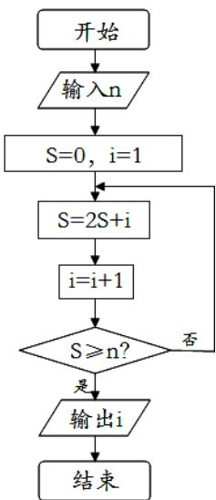

<!-- question-source:start -->
13.当实数 x, y 满足 $\left\{\begin{aligned}x+2y-4&\leq0\\ x-y-1&\leq0\\ x&\geq1\end{aligned}\right.$ 时， $1\leq ax+y\leq4$ 恒成立，
则实数 a 的取值范围是 \_\_\_\_。

<!-- question-source:end -->

![[高中/真题/按年份分类/2014/2014年浙江高考数学_理科_试卷_含答案_/填空题/题目/answers/Q00026137A1.md]]
