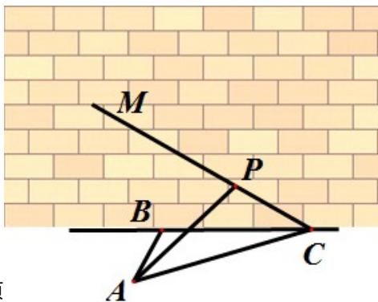

<!-- question-source:start -->
17、如图，某人在垂直于水平地面 ABC 的墙面前的点 A 处进行射击训练. 已知点 A 到墙面的距离为 AB，某目标点 P 沿墙面上的射击线 CM 移动，此人为了准确瞄准目标点 P，需计算由点 A 观察点 P 的仰角 $\theta$ 的大小。若 AB = 15m，AC = 25m， $\angle BCM = 30^{\circ}$ ，则 $\tan \theta$ 的最大值是 \_\_\_\_（仰角 $\theta$ 为直线 AP 与平面 ABC 所成角）

<!-- question-source:end -->

![[高中/真题/按年份分类/2014/2014年浙江高考数学_理科_试卷_含答案_/填空题/题目/answers/Q00027447A1.md]]
