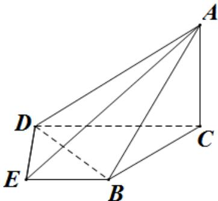
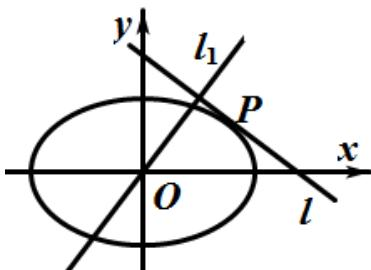

<!-- question-source:start -->
21. 如图，在四棱锥 A-BCDE 中，平面 $ABC \perp$ 平面 BCDE， $\angle CDE = \angle BED = 90^{\circ}$ ，AB = CD = 2，DE = BE = 1， $AC = \sqrt{2}$ .

(I) 证明: $DE \perp$ 平面 $ACD$ ;

(Ⅱ) 求二面角 B - AD - E 的大小.

21(本题满分 15 分)

如图, 设椭圆 C: $\frac{x^{2}}{a^{2}} + \frac{y^{2}}{b^{2}} = 1 (a > b > 0)$ 动直线 l 与椭圆 C 只有一个公共点 P, 且点 P 在第一象限.

(I) 已知直线 $l$ 的斜率为 $k$ ，用 $a, b, k$ 表示点 $\mathbf{P}$ 的坐标；

(Ⅱ) 若过原点 O 的直线 $l_{1}$ 与 l 垂直，证明：点 P 到直线 $l_{1}$ 的距离的最大值为 a - b.

<!-- question-source:end -->

![[高中/真题/按年份分类/2014/2014年浙江高考数学_理科_试卷_含答案_/填空题/题目/answers/Q00028342A1.md]]
