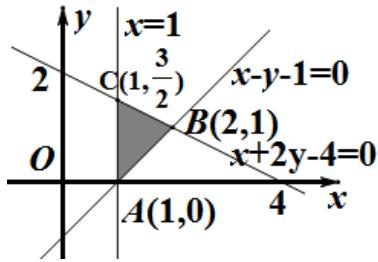

> [!faq]- 2014年浙江高考数学(理科)试卷(含答案)解析
>
> > [!success]- **【答案】** $[1, \frac{3}{2}]$
>
> > [!note]- **【分析】**
> > 可知， $a \geq 0$ 且在 $A(1,0)$ 点取得最小值，在 $B(2,1)$ 取得最大值，故 $\left\{ \begin{array}{l} a \geq 1 \\ 2a + 1 \leq 4 \end{array} \right.$ 得 $1 \leq a \leq \frac{3}{2}$ ，故实数 $a$ 的取值范围是 $[1, \frac{3}{2}]$ ，
> > 【
>
> > [!note]- **【解析】**
> > 作出不等式组 $\left\{\begin{aligned}x+2y-4&\leq0\\ x-y-1&\leq0\\ x&\geq1\end{aligned}\right.$ 所表示的区
> > 如图，由 $1 \leq ax + y \leq 4$ 恒成立，故 $A(1,0), B(2,1), C(1,\frac{3}{2})$ 三点坐标代入
> >
> > 
> >
> > $1 \leq ax + y \leq 4$ ，均成立得 $\left\{ \begin{array}{l} 1 \leq a \leq 4 \\ 1 \leq 2a + 1 \leq 4 \\ 1 \leq a + \frac{3}{2} \leq 4 \end{array} \right.$ 解得 $1 \leq a \leq \frac{3}{2}$ ， $\therefore$ 实数 $a$ 的取值范围是 $[1, \frac{3}{2}]$ ，
> >
> > $$
> > [ 1, \frac {3}{2} ]
> > $$
> >
> > 【
