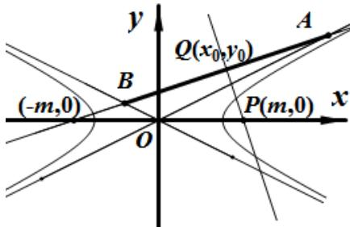

> [!faq]- 2014年浙江高考数学(理科)试卷(含答案)解析
>
> > [!success]- **【答案】** $\frac{\sqrt{5}}{2}$ 17. 【
>
> > [!note]- **【分析】**
> > 知，当 $\tan\theta$ 取得最大时，即 $\theta$ 最大，最大值即为平面 ACM 与地面 ABC 所成的锐二面角的度量值，
> > 如图，过 B 在面 BCM 内作 BD⊥BC 交 CM 于 D，过 B 作 BH⊥AC 于 H，连 DH，则 $\angle BHD$ 即为平面 ACM 与地面 ABC 所成的二面角的平面角， $\tan\theta$ 的最大值即为 $\tan\angle BHD$ ，在 $Rt\triangle ABC$ 中，
>
> > [!note]- **【解析】**
> > 1】由双曲线的方程可知，它的渐近线方程为 $y=\frac{b}{a}x$ 和 $y=-\frac{b}{a}x$ ，分别与直线 l:x-3y+m=0 联立方程组，解得， $A(\frac{-am}{a-3b},\frac{-bm}{a-3b})$ , $B(\frac{-am}{a+3b},\frac{bm}{a+3b})$ ，设 AB 中点为 Q，由 $|PA|=\left|PB\right|$ 得，则
> >
> > 
> >
> > $Q(\frac{-am}{a-3b}+\frac{-am}{a+3b},\frac{-bm}{a-3b}+\frac{bm}{a+3b})$ 即 $Q(-\frac{a^{2}m}{a^{2}-9b^{2}},-\frac{3b^{2}m}{a^{2}-9b^{2}})$ ，PQ 与已知直线垂直， $\therefore k_{PQ}\square k_{l}=-1$ ，即 $\frac{-\frac{3b^{2}m}{a^{2}-9b^{2}}}{-\frac{a^{2}m}{a^{2}-9b^{2}}-m}\square\frac{1}{3}=-1$ 即得
> >
> > $2a^{2}=8b^{2}$ ，即 $2a^{2}=8(c^{2}-a^{2})$ ，即 $\frac{c^{2}}{a^{2}}=\frac{5}{4}$ ，所以 $e=\frac{c}{a}=\frac{\sqrt{5}}{2}$
> >
> > 【
