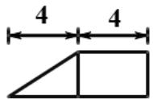

<!-- question-source:start -->
3. 某几何体的三视图（单位：cm）如图所示，则此几何体的表面积是( )

$$
9 0 c m ^ {2}
$$

$$
1 2 9 c m ^ {2}
$$

$$
1 3 2 c m ^ {2}
$$

$$
1 3 8 c m ^ {2}
$$

<!-- question-source:end -->

![[高中/真题/按年份分类/2014/2014年浙江高考数学_理科_试卷_含答案_/选择题/题目/answers/Q00026127A1.md]]
