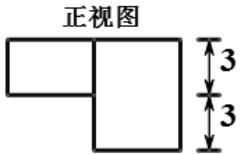

<!-- question-source:start -->
4. 为了得到函数 $y = \sin 3x + \cos 3x$ 的图像，可以将函数 $y = \sqrt{2} \cos 3x$ 的图像（）
A. 向右平移 $\frac{\pi}{4}$ 个单位 B. 向左平移 $\frac{\pi}{4}$ 个单位 C. 向右平移 $\frac{\pi}{12}$ 个单位 D. 向左平移 $\frac{\pi}{12}$ 个单位

  
俯视图
<!-- question-source:end -->

![[高中/真题/按年份分类/2014/2014年浙江高考数学_理科_试卷_含答案_/选择题/题目/answers/Q00026128A1.md]]
