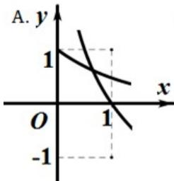
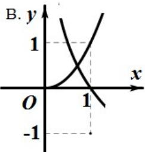
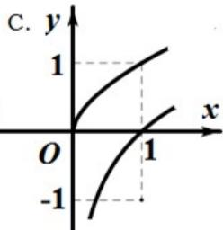
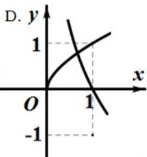

<!-- question-source:start -->
7. 在同一直角坐标系中，函数 $f(x)=x^{a}(x\geq0)$ ， $g(x)=\log_{a}x$ 的图像可能是（）

<!-- question-source:end -->

![[高中/真题/按年份分类/2014/2014年浙江高考数学_理科_试卷_含答案_/选择题/题目/answers/Q00026131A1.md]]
