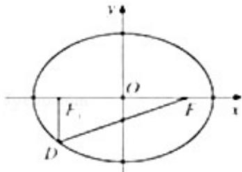

<!-- question-source:start -->
21.（12分）（2014·重庆）如图，设椭圆 $\frac{x^2}{a^2} +\frac{y^2}{b^2} = 1(a > b > 0)$ 的左右焦点分别为 $F_{1},F_{2}$ ，点D在椭圆上， $\mathrm{DF}_1\bot \mathrm{F}_1\mathrm{F}_2$ $\frac{|F_1F_2|}{|DF_1|} = 2\sqrt{2}$ ， $\triangle \mathrm{DF}_1\mathrm{F}_2$ 的面积为 $\frac{\sqrt{2}}{2}$

（Ⅰ）求该椭圆的标准方程；

（II）是否存在圆心在 y 轴上的圆，使圆在 x 轴的上方与椭圆有两个交点，且圆在这两个交点处的两条切线互相垂直并分别过不同的焦点？若存在，求出圆的方程；若不存在，请说明理由.

# 2014 年重庆市高考数学试卷（文科）

参考
<!-- question-source:end -->

![[高中/真题/按年份分类/2014/2014年重庆市高考数学试卷_文科_含答案/填空题/题目/answers/Q00022967A1.md]]
