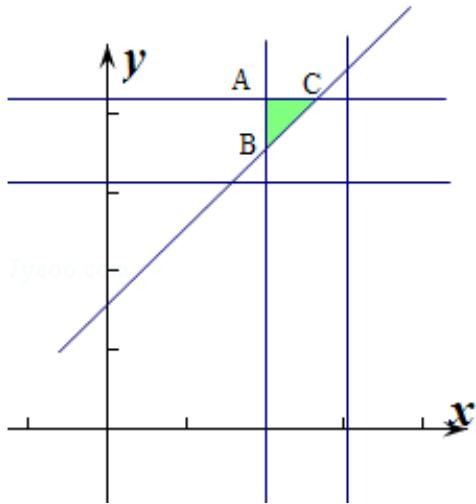

> [!faq]- 2014年重庆市高考数学试卷(文科)含答案解析
>
> > [!success]- **【答案】** $\frac{9}{32}$
>
> > [!note]- **【分析】**
> > 设小张到校的时间为 x，小王到校的时间为 y. (x, y) 可以看成平面中的点试验的全部结果所构成的区域为 $\Omega=\left\{\left(x,y\right|7\frac{1}{2}\leq x\leq7\frac{5}{6},7\frac{1}{2}\leq y\leq7\frac{5}{6}\right\}$ 是一个矩形区域，则小张比小王至少早 5 分钟到校事件 $A=\left\{(x,y)\mid y-x\geq\frac{1}{12}\right\}$ 作出符合题意的图象，由图根据几何概率模型的规则求解即可.
>
> > [!note]- **【解析】**
> > 解：设小张到校的时间为 x，小王到校的时间为 y.
> > (x, y) 可以看成平面中的点试验的全部结果所构成的区域为 $\Omega=\left\{\left(x,y\right|7\frac{1}{2}\leq x\leq7\frac{5}{6},7\frac{1}{2}\leq y\leq7\frac{5}{6}\right\}$ 是一个矩形区域，对应的面积 $S=\frac{1}{3}\times\frac{1}{3}=\frac{1}{9}$ ,
> > 则小张比小王至少早5分钟到校事件 $A=\left\{x\mid y-x\geq\frac{1}{12}\right\}$ 作出符合题意的图象，
> > A $(7\frac{1}{2}, 7\frac{5}{6})$ ，当 $x=7\frac{1}{2}$ 时， $y=7\frac{1}{2}+\frac{1}{12}=7\frac{7}{12}$ ，则 AB= $7\frac{5}{6}-7\frac{7}{12}=\frac{1}{4}$ ,
> > 则三角形 ABC 的面积 $S=\frac{1}{2}\times\frac{1}{4}\times\frac{1}{4}=\frac{1}{32}$ 由几何概率模型可知小张比小王至少早5分钟到校的
> >
> > 概率为 $\frac{\frac{1}{32}}{\frac{1}{9}}=\frac{9}{32}$ ,
> >
> > 故答案为： $\frac{9}{32}$ .
> >
> > 
> >
> > 点评：
> >
> > 本题考查几何概率模型与模拟方法估计概率，求解的关键是掌握两种求概率的方法的定义及规则，求出对应区域的面积是解决本题的关键.
> >
> > ##
> > 三、解答题：本大题共6小题，共75分．解答应写出文字说明，证明过程或演算步骤.
