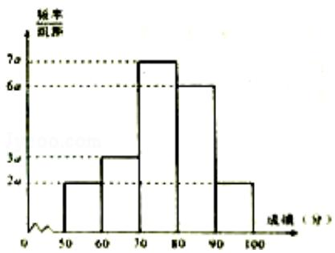

<!-- question-source:start -->
17. （13 分）（2014·重庆）20 名学生某次数学考试成绩（单位：分）的频率分布直方图如图：

（Ⅰ）求频率分布直方图中 a 的值；

（Ⅱ）分别求出成绩落在[50，60）与[60，70）中的学生人数；

（III）从成绩在[50，70）的学生任选2人，求此2人的成绩都在[60，70）中的概率.

<!-- question-source:end -->

![[高中/真题/按年份分类/2014/2014年重庆市高考数学试卷_文科_含答案/解答题/题目/answers/Q00022963A1.md]]
