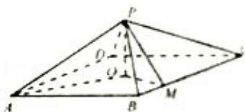

<!-- question-source:start -->
20. (12 分) (2014·重庆) 如图, 四棱锥 P - ABCD 中, 底面是以 O 为中心的菱形, PO⊥底面 ABCD, AB=2, ∠BAD= $\frac{\pi}{3}$ , M 为 BC 上一点, 且 BM= $\frac{1}{2}$ .

（Ⅰ）证明：BC⊥平面POM；

（Ⅱ）若 MP⊥AP，求四棱锥 P-ABMO 的体积.

<!-- question-source:end -->

![[高中/真题/按年份分类/2014/2014年重庆市高考数学试卷_文科_含答案/解答题/题目/answers/Q00022966A1.md]]
