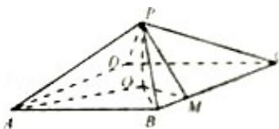
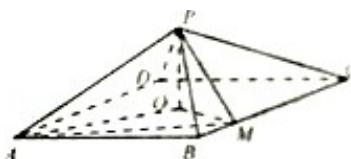

> [!faq]- 2014年重庆市高考数学试卷(文科)含答案解析
>
> > [!success]- **【答案】** 详见解析
>
> > [!note]- **【分析】**
> > 本题未单列分析。
>
> > [!note]- **【解析】**
> > .
> >
> > 证明：（Ⅰ）∵底面是以O为中心的菱形，PO⊥底面ABCD，
> >
> > 
> >
> > 故 O 为底面 ABCD 的中心，连接 OB，则 AO⊥OB，
> > ∵AB=2， $\angle BAD=\frac{\pi}{3}$
> >
> > $$
> > \therefore \mathrm{OB} = \mathrm{AB} \cdot \sin \angle \mathrm{BAO} = 2 \sin \left(\frac {\pi}{2} - \frac {\pi}{3}\right) = 1,
> > $$
> >
> > 又∵BM= $\frac{1}{2}$ ， $\angle OBM=\frac{\pi}{3}$
> >
> > ∴在 $\triangle OBM$ 中， $OM^{2}=OB^{2}+BM^{2}-2OB\cdot BM\cdot\cos\angle OBM=\frac{3}{4}$ ，
> >
> > 即 $\mathrm{OB}^2 = \mathrm{OM}^2 +\mathrm{BM}^2$ ，即 $\mathrm{OM}\bot \mathrm{BM}$
> >
> > ∴OM⊥BC,
> >
> > 又∵PO⊥底面ABCD，BCC底面ABCD，
> >
> > 又∵OM∩PO=O，OM，PO⊂平面POM，
> >
> > ∴BC⊥平面POM;
> >
> > （Ⅱ）由（Ⅰ）可得：OA=AB·cos∠BAO=2cos $\left(\frac{\pi}{2}-\frac{\pi}{3}\right)=\sqrt{3}$ ,
> >
> > 设 PO=a，由 PO⊥底面 ABCD 可得：△POA 为直角三角形，
> >
> > 故 $PA^{2}=PO^{2}+OA^{2}=a^{2}+3$ ,
> >
> > 由 $\triangle \mathrm{POM}$ 也为直角三角形得：
> >
> > $\mathrm{PM}^2 = \mathrm{PO}^2 +\mathrm{OM}^2 = \mathrm{a}^2 +\frac{3}{4},$
> >
> > 连接 AM，
> >
> > 
> >
> > 在 $\triangle ABM$ 中， $AM^{2}=AB^{2}+BM^{2}-2AB\cdot BM\cdot\cos\angle ABM=$
> >
> > $$
> > 2 ^ {2} + \left(\frac {1}{2}\right) ^ {2} - 2 \cdot 2 \cdot \frac {1}{2} \cdot \cos \frac {2 \pi}{3} = \frac {2 1}{4},
> > $$
> >
> > 由 MP⊥AP 可知：△APM 为直角三角形，
> >
> > 则 $\mathrm{AM}^2 = \mathrm{PA}^2 +\mathrm{PM}^2$ ，即 $a^2 +3 + a^2 +\frac{3}{4} = \frac{21}{4},$ 解得 $a = \frac{\sqrt{3}}{2}$ ，即 $\mathrm{PO} = \frac{\sqrt{3}}{2}$ 此时四棱锥P-ABMO的底面积 $S = S_{\triangle AOB} + S_{\triangle BOM} = \frac{1}{2}$ $\cdot \mathrm{AO}\cdot \mathrm{OB} + \frac{1}{2}\cdot \mathrm{BM}\cdot \mathrm{OM} = \frac{5\sqrt{3}}{8},$ ∴四棱锥P-ABMO的体积 $\mathrm{V} = \frac{1}{3}\mathrm{S}\cdot \mathrm{PO} = \frac{5}{16}$ 本题考查的知识点是棱锥的体积，直线与平面垂直的判定，难度中档.
> >
> > 点评：
> >
> > PO⊥BC，进而由线面垂直的判定定理得到 BC⊥平面 POM;
> >
> > （Ⅱ）设 PO=a，利用勾股定理和余弦定理解三角形求出 PO 的值，及四棱锥 P-ABMO 的底面积 S，代入棱锥体积公式，可得
