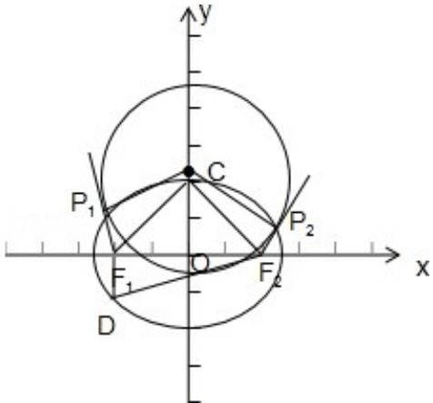

> [!faq]- 2014年重庆市高考数学试卷(文科)含答案解析
>
> > [!success]- **【答案】** 详见解析
>
> > [!note]- **【分析】**
> > 直线与圆锥曲线的综合问题.
>
> > [!note]- **【解析】**
> > 解：（Ⅰ）设 $F_{1}(-c,0)$ ， $F_{2}(c,0)$ ，其中 $c^{2}=a^{2}-b^{2}$ ，
> > 由 $\frac{\left|F_{1}F_{2}\right|}{\left|DF_{1}\right|}=2\sqrt{2}$ ，得 $\left|DF_{1}\right|=\frac{\left|F_{1}F_{2}\right|}{2\sqrt{2}}=\frac{\sqrt{2}}{2}c$ 从而 $S_{\triangle DF_{1}F_{2}}=\frac{1}{2}\left|DF_{1}\right|\left|F_{1}F_{2}\right|=\frac{\sqrt{2}}{2}c^{2}=\frac{\sqrt{2}}{2}$ ，故 c=1.
> >
> > 从而 $\left|DF_{1}\right|=\frac{\sqrt{2}}{2}$ ，由 $DF_{1}\perp F_{1}F_{2}$ ，得 $\left|DF_{2}\right|^{2}=\left|DF_{1}\right|^{2}+\left|F_{1}F_{2}\right|^{2}=\frac{9}{2}$ 因此 $|DF_{2}|=\frac{3\sqrt{2}}{2}$ 所以 $2a=|DF_{1}|+|DF_{2}|=2\sqrt{2}$ ，故 $a=\sqrt{2}$ ， $b^{2}=a^{2}-c^{2}=1$ ，
> > 因此，所求椭圆的标准方程为 $\frac{x^{2}}{2}+y^{2}=1$ ;
> >
> > （Ⅱ）设圆心在 y 轴上的圆 C 与椭圆 $\frac{x^{2}}{2} + y^{2} = 1$ 相交， $P_{1}(x_{1}, y_{1})$ ， $P_{2}(x_{2}, y_{2})$ 是两个交点，
> >
> > 
> >
> > $y_{1}>0,\quad y_{2}>0,\quad F_{1}P_{1},\quad F_{2}P_{2}$ 是圆C的切线，且 $F_{1}P_{1}\perp F_{2}P_{2}$ ，由圆和椭圆的对称性，易知 $x_{2}=-x_{1},\quad y_{1}=y_{2},\quad|P_{1}P_{2}|=2|x_{1}|$ ，由（I）知 $F_{1}(-1,0),F_{2}(1,0)$ ，所以 $\overrightarrow{F_{1}P_{1}}=(x_{1}+1,y_{1})$ ， $\overrightarrow{F_{2}P_{2}}=(-x_{1}-1,y_{1})$ ，再由 $F_{1}P_{1}\perp F_{2}P_{2}$ ，得 $-\left(x_{1}+1\right)^{2}+y_{1}^{2}=0$ ，由椭圆方程得 $1-\frac{x_{1}^{2}}{2}=(x_{1}+1)^{2}$ ，即 $3x_{1}^{2}+4x_{1}=0$ ，解得 $x_{1}=-\frac{4}{3}$ 或 $x_{1}=0$ 。当 $x_{1}=0$ 时， $P_{1},P_{2}$ 重合，此时题设要求的圆不存在；当 $x_{1}=-\frac{4}{3}$ 时，过 $P_{1},P_{2}$ ，分别与 $F_{1}P_{1},F_{2}P_{2}$ 垂直的直线的交点即为圆心C，设C(0， $y_{0}$ )由 $F_{1}P_{1},F_{2}P_{2}$ 是圆C的切线，知 $CP_{1}\perp F_{1}P_{1}$ ，得 $\frac{y_{1}-y_{0}}{x_{1}}\cdot\frac{y_{1}}{x_{1}+1}=-1$ ，而 $|y_{1}|=|x_{1}+1|=\frac{1}{3}$ ，
> >
> > 点评：
> >
> > 故 $y_{0}=\frac{5}{3}$ ,
> >
> > 故圆 C 的半径 $\left|CP_{1}\right|=\sqrt{\left(-\frac{4}{3}\right)^{2}+\left(\frac{1}{3}-\frac{5}{3}\right)^{2}}=\frac{4\sqrt{2}}{3}.$ 综上，存在满足题设条件的圆，其方程为 $x^{2}+\left(y-\frac{5}{3}\right)^{2}=\frac{32}{9}.$
> >
> > 本题考查直线与圆锥曲线的综合问题，考查化归思想、方程思想分类讨论思想的综合应用，考查综合分析与运算能力，属于难题.
