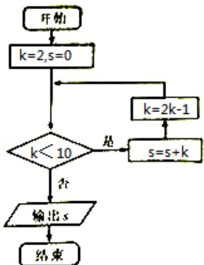

<!-- question-source:start -->
5. （5分）（2014·重庆）执行如图所示的程序框图，则输出s的值为（）

A. 10 B. 17 C. 19 D. 36
<!-- question-source:end -->

![[高中/真题/按年份分类/2014/2014年重庆市高考数学试卷_文科_含答案/选择题/题目/answers/Q00022951A1.md]]
