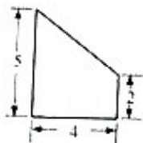
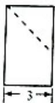
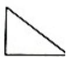

<!-- question-source:start -->
7. （5分）（2014·重庆）某几何体的三视图如图所示，则该几何体的体积为（）

  
正视图

  
左视图

  
俯视图

A. 12 B. 18 C. 24 D. 30
<!-- question-source:end -->

![[高中/真题/按年份分类/2014/2014年重庆市高考数学试卷_文科_含答案/选择题/题目/answers/Q00022953A1.md]]
