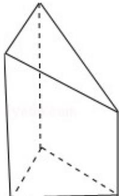

> [!faq]- 2014年重庆市高考数学试卷(文科)含答案解析
>
> > [!success]- **【答案】** C
>
> > [!note]- **【分析】**
> > 本题未单列分析。
>
> > [!note]- **【解析】**
> > 由三视图求面积、体积.
> > 计算题；空间位置关系与距离.
> > 几何体是三棱柱消去一个同底的三棱锥，根据三视图判断三棱柱的高及消去的三棱锥的高，判断三棱锥与三棱柱的底面三角形的形状及相关几何量的数据，把数据代入棱柱与棱锥的体积公式计算.
> > 解：由三视图知：几何体是三棱柱消去一个同底的三棱锥，如图：
> > 三棱柱的高为5，消去的三棱锥的高为3，
> > 三棱锥与三棱柱的底面为直角边长分别为3和4的等腰直角三角形，
> > ∴几何体的体积 $V=\frac{1}{2}\times3\times4\times5-\frac{1}{3}\times\frac{1}{2}\times3\times4\times3=30-6=24$ .
> >
> > 故选：C.
> >
> > 
> >
> > 点评：
> >
> > 本题考查了由三视图求几何体的体积, 根据三视图判断几何体的形状及数据所对应的几何量是解题的关键.
