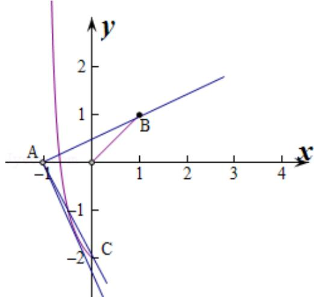

> [!faq]- 2014年重庆市高考数学试卷(文科)含答案解析
>
> > [!success]- **【答案】** A
>
> > [!note]- **【分析】**
> > 本题未单列分析。
>
> > [!note]- **【解析】**
> > 由 $g(x) = f(x) - mx - m = 0$ ，即 $f(x) = m(x + 1)$ ，作出两个函数的图象，利用数形结合即可得到结论.
> >
> > 解：由 $g(x) = f(x) - mx - m = 0$ ，即 $f(x) = m(x + 1)$ ，分别作出函数 $f(x)$ 和 $y = g(x) = m(x + 1)$ 的图象如图：由图象可知 $f(1) = 1$ ， $g(x)$ 表示过定点 $A(-1,0)$ 的直线，
> >
> > 当 $g(x)$ 过 (1,1) 时， $m = \frac{1}{2}$ 此时两个函数有两个交点，此时满足条件的 $m$ 的取值范围是 $0 < m \leq \frac{1}{2}$ ,
> >
> > 当 $g(x)$ 过 (0,-2) 时， $g(0) = -2$ ，解得 $m = -2$ ，此时两个函数有两个交点，
> >
> > 当 $g(x)$ 与 $f(x)$ 相切时，两个函数只有一个交点，
> >
> > 此时 $\frac{1}{x + 1} - 3 = m(x + 1)$ 即 $m(x + 1)^2 + 3(x + 1) - 1 = 0$ ,
> >
> > 当 $m = 0$ 时， $x = -\frac{2}{3}$ ，只有 1 解，
> >
> > 当 $m \neq 0$ ，由 $\triangle = 9 + 4m = 0$ 得 $m = -\frac{9}{4}$ ，此时直线和 $f(x)$ 相切，
> >
> > ∴要使函数有两个零点，
> >
> > 则 $-\frac{9}{4} < m \leq -2$ 或 $0 < m \leq \frac{1}{2}$ ,
> >
> > 故选：A
> >
> > 
> >
> > 点评：
> >
> > 本题主要考查函数零点的应用，利用数形结合是解决此类问题的基本方法.
> >
> > ##
> > 二、填空题：本大题共5小题，每小题5分，把答案填写在答题卡相应的位置上.
