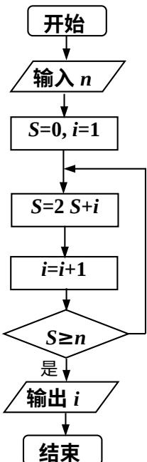

<!-- question-source:start -->
15、设函数 $f(x)=\left\{\begin{aligned}x^{2}+2x+2,&x\leq0\\ -x^{2},&x>0\end{aligned}\right.$ ，若 $f(f(a))=2$ ，则 a=\_\_\_\_；

<!-- question-source:end -->

![[高中/真题/按年份分类/2014/2014年高考浙江文科数学试题及答案_精校版_/填空题/题目/answers/Q00023606A1.md]]
