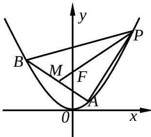

<!-- question-source:start -->
18、(本题满分 14 分)

在 $\Delta ABC$ 中，内角A，B，C所对的边分别为 $a,b,c$ ，已知

$$
4 \sin^ {2} \frac {A - B}{2} + 4 \sin A \sin B = 2 + \sqrt {2}
$$

(1) 求角 C 的大小； (2) 已知 b=4， $\Delta ABC$ 的面积为 6，求边长 c 的值。

## 19、(本题满分 14 分)

已知等差数列 $\{a_{n}\}$ 的公差 $d > 0$ ，设 $\{a_{n}\}$ 的前 $n$ 项和为 $S_{n}$ ， $a_1 = 1$ ， $S_{2} \cdot S_{3} = 36$

(1) 求 $d$ 及 $S_{n}$ ;

(2) 求 $m, k \quad (m, k \in N^{*})$ 的值，使得 $a_{m} + a_{m+1} + a_{m+2} + \cdots + a_{m+k} = 65$

## 20、(本题满分15分)

如图，在四棱锥 A—BCDE 中，平面 $ABC \perp$ 平面 BCDE； $\angle CDE = \angle BED = 90^{\circ}$ ，AB = CD = 2，DE = BE = 1， $AC = \sqrt{2}$ 。

(1) 证明: $AC \perp$ 平面 $BCDE$ ;

(2) 求直线 $AE$ 与平面ABC所成的角的正切值。

## 21、(本题满分 15 分)

已知函数 $f(x) = x^3 + 3 |x - a| (a > 0)$ ，若 $f(x)$ 在 $[-1, 1]$ 上的最小值记为 $g(a)$ 。

(1) 求 $g(a)$ ;

(2) 证明：当 $x \in [-1,1]$ 时，恒有 $f(x) \leq g(a) + 4$

## 22、(本题满分 14 分)

已知 $\Delta ABP$ 的三个顶点在抛物线C： $x^{2} = 4y$ 上，F为抛物线C的焦点，点M为AB的中点， $PF = 3FM$ ；

(1) 若 $\left|PF\right|=3$ ，求点 M 的坐标；

(2) 求 $\Delta ABP$ 面积的最大值。

# 2014年高考浙江卷文科数学参考
<!-- question-source:end -->

![[高中/真题/按年份分类/2014/2014年高考浙江文科数学试题及答案_精校版_/解答题/题目/answers/Q00023609A1.md]]
