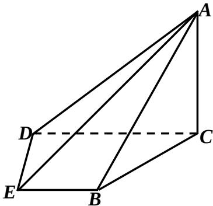

<!-- question-source:start -->
## 20、(本题满分15分)

如图，在四棱锥 A—BCDE 中，平面 $ABC \perp$ 平面 BCDE； $\angle CDE = \angle BED = 90^{\circ}$ ，AB = CD = 2，DE = BE = 1， $AC = \sqrt{2}$ 。

(1) 证明: $AC \perp$ 平面 $BCDE$ ;

(2) 求直线 $AE$ 与平面ABC所成的角的正切值。

<!-- question-source:end -->

![[高中/真题/按年份分类/2014/2014年高考浙江文科数学试题及答案_精校版_/解答题/题目/answers/Q00029685A1.md]]
