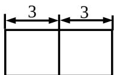

<!-- question-source:start -->
3、某几何体的三视图（单位：cm）如图所示，则该几何体的的体积是（）

$$
7 2 \mathrm{cm} ^ {3}
$$

$$
9 0 \mathrm{cm} ^ {3}
$$

$$
1 0 8 \mathrm{cm} ^ {3}
$$

$$
1 3 8 \mathrm{cm} ^ {3}
$$

<!-- question-source:end -->

![[高中/真题/按年份分类/2014/2014年高考浙江文科数学试题及答案_精校版_/选择题/题目/answers/Q00023594A1.md]]
