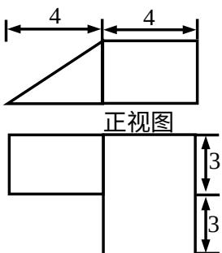

<!-- question-source:start -->
4、为了得到函数 $y = \sin 3x + \cos 3x$ 的图象，可以将函数 $y = \sqrt{2} \cos 3x$ 的图像（）
A. 向右平移 $\frac{1}{12}$ 个单位 B. 向右平移 $\frac{1}{4}$ 个单位
C. 向左平移 $\frac{1}{12}$ 个单位 D. 向左平移 $\frac{1}{4}$ 个单位

  
侧视图  
俯视图
<!-- question-source:end -->

![[高中/真题/按年份分类/2014/2014年高考浙江文科数学试题及答案_精校版_/选择题/题目/answers/Q00023595A1.md]]
