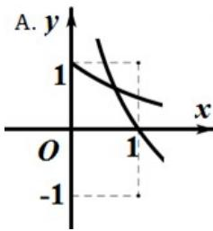
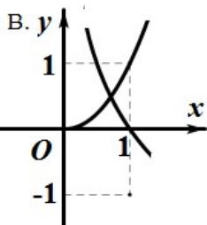
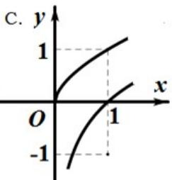
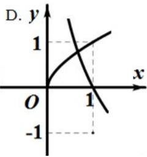

<!-- question-source:start -->
8、在同一直角坐标系中，函数 $f(x)=x^{a}$ （x>0）， $g(x)=\log_{a}x$ 的图象可能是（）

<!-- question-source:end -->

![[高中/真题/按年份分类/2014/2014年高考浙江文科数学试题及答案_精校版_/选择题/题目/answers/Q00023599A1.md]]
