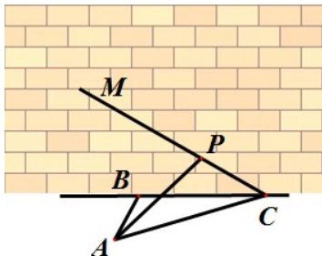

<!-- question-source:start -->
10、如图，某人在垂直于水平地面 ABC 的墙面前的点 A 处进行射击训练，已知点 A 到墙面的距离为 AB，某目标点 P 沿墙面的射击线 CM 移动，此人为了准确瞄准目标点 P，需计算由点 A 观察点 P 的仰角 $\theta$ 的大小（仰角 $\theta$ 为直线 AP 与平面 ABC 所成角）。若 AB = 15m，AC = 25m， $\angle BCM = 30^{\circ}$ 则 $\tan \theta$ 的最大值（）
A. $\frac{\sqrt{30}}{5}$ B. $\frac{\sqrt{30}}{10}$ C. $\frac{4\sqrt{3}}{9}$ D. $\frac{5\sqrt{3}}{9}$

<!-- question-source:end -->

![[高中/真题/按年份分类/2014/2014年高考浙江文科数学试题及答案_精校版_/选择题/题目/answers/Q00023601A1.md]]
