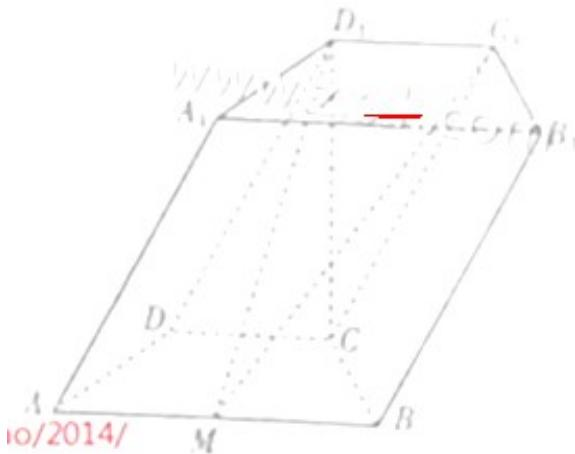

<!-- question-source:start -->
## 17.（本小题满分12分）

如图, 在四棱柱 $ABCD - A_1B_1C_1D_1$ 中, 底面 $ABCD$ 是等腰梯形, $\angle DAB = 60^\circ$ , $AB = 2CD = 2$ , $M$ 是线段 $AB$ 的中点.

(Ⅰ) 求证: $C_{1}M \parallel A_{1}ADD_{1}$ ;

（Ⅱ）若 $CD_{1}$ 垂直于平面 ABCD 且 $CD_{1}=\sqrt{3}$ ，求平面 $C_{1}D_{1}M$ 和平面 ABCD 所成的角（锐角）的余弦值.

<!-- question-source:end -->

![[高中/真题/按年份分类/2014/2014年高考真题数学_理__山东卷__含解析版_/解答题/题目/answers/Q00027622A1.md]]
