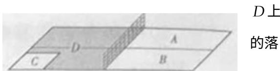

<!-- question-source:start -->
## 18. (本小题满分 12 分)

乒乓球台面被网分成甲、乙两部分，如图，

甲上有两个不相交的区域 $A, B$ ，乙被划分为两个不相交的区域 $C, D$ . 某次测试要求队员接到落点在甲上的

来球后向乙回球.规定：回球一次，落点在 $C$ 上记3分，在记1分，其它情况记0分.对落点在 $A$ 上的来球，小明回球点在 $C$ 上的概率为 $\frac{1}{2}$ ，在 $D$ 上的概率为 $\frac{1}{3}$ ；对落点在 $B$ 上

球, 小明回球的落点在 $C$ 上的概率为 $\frac{1}{5}$ , 在 $D$ 上的概率为 $\frac{3}{5}$ . 假设共有两次来球且落在 $A, B$ 上各一次, 小明的两次回球互不影响. 求:

（Ⅰ）小明的两次回球的落点中恰有一次的落点在乙上的概率；

（Ⅱ）两次回球结束后，小明得分之和 $\xi$ 的分布列与数学期望.
<!-- question-source:end -->

![[高中/真题/按年份分类/2014/2014年高考真题数学_理__山东卷__含解析版_/解答题/题目/answers/Q00027623A1.md]]
