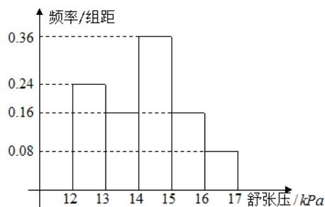

<!-- question-source:start -->
7.为研究某药品的疗效，选取若干名志愿者进行临床试验，所有志愿者的舒张压数据（单位： $kPa$ ）的分组区间为 $[12,13)$ ， $[13,14)$ ， $[14,15)$ ， $[15,16)$ ， $[16,17]$ ，将其按从左到右的顺序分别编号为第一组，第二组，……，第五组.右图是根据试验数据制成的频率分布直方图.已知第一组与第二组共有20人，第三组中没有疗效的有6人，则第三组中有疗效的人数为( )

A.1    B.8    C.12    D.18

<!-- question-source:end -->

![[高中/真题/按年份分类/2014/2014年高考真题数学_理__山东卷__含解析版_/选择题/题目/answers/Q00023425A1.md]]
