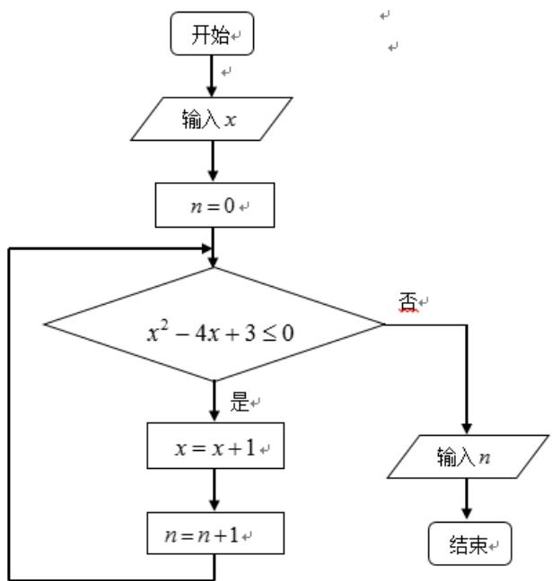

> [!faq]- 2014年高考真题数学【理】(山东卷)（含解析版）解析
>
> > [!success]- **【答案】** A
>
> > [!note]- **【分析】**
> > 本题未单列分析。
>
> > [!note]- **【解析】**
> > $$
> > e _ {1} ^ {2} = \frac {c ^ {2}}{a ^ {2}} = \frac {a ^ {2} - b ^ {2}}{a ^ {2}}
> > $$
> >
> > $$
> > e _ {2} ^ {2} = \frac {c ^ {2}}{a ^ {2}} = \frac {a ^ {2} + b ^ {2}}{a ^ {2}}
> > $$
> >
> > $$
> > \therefore \left(e _ {1} e _ {2}\right) ^ {2} = \frac {a ^ {4} - b ^ {4}}{a ^ {4}} = \frac {3}{4} \therefore a ^ {4} = 4 b ^ {4}
> > $$
> >
> > $$
> > \therefore \frac {b}{a} = \pm \frac {\sqrt {2}}{2}
> > $$
> >
> > ##
> > 二．填空题：本大题共5小题，每小题5分，共25分，答案须填在题中横线上。
> >
> > 
