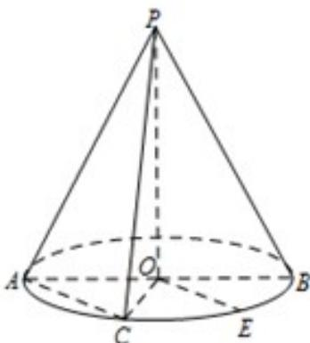

<!-- question-source:start -->
19. (本题满分 12 分)

如图，圆锥的顶点为 P，底面的一条直径为 AB，C 为半圆弧 AB 的中点，E 为劣弧 CB 的中点。已知 PO = 2，OA = 1，求三棱锥 P - AOC 的体积，并求异面直线 PA 与 OE 所成角的大小。

<!-- question-source:end -->

![[高中/真题/按年份分类/2015/2015年上海高考数学真题_文科_试卷_word解析版_/解答题/题目/answers/Q00022547A1.md]]
