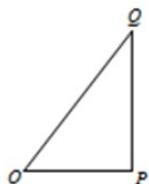

<!-- question-source:start -->
21.（本小题 14 分）本题共 2 小题，第 1 小题 6 分，第 2 小题 8 分.

如图，O, P, Q 三地有直道相通，OQ = 5 千米，OP = 3 千米，PQ = 4 千米。现甲、乙两警员同时从 O 地出发匀速前往 Q 地，经过 t 小时，他们之间的距离为 $f(t)$ （单位：千米）。甲的路线是 OQ，速度为 5 千米/小时，乙的路线是 OPQ，速度为 8 千米/小时。乙到达 Q 地后原地等待。设 $t = t_{1}$ 时乙到达 P 地； $t = t_{2}$ 时，乙到达 Q 地。

(1) 求 $t_{1}$ 与 $f(t_{1})$ 的值;

(2) 已知警员的对讲机的有效通话距离是 3 千米. 当 $t_1 \leq t \leq t_2$ 时, 求 $f(t)$ 的表达式, 并判断 $f(t)$ 在 $[t_1, t_2]$ 上得最大值是否超过 3? 说明理由.

<!-- question-source:end -->

![[高中/真题/按年份分类/2015/2015年上海高考数学真题_文科_试卷_word解析版_/解答题/题目/answers/Q00022549A1.md]]
