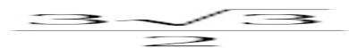

<!-- question-source:start -->
17. 已知点 A 的坐标为 $(4\sqrt{3},1)$ ，将 OA 绕坐标原点 O 逆时针旋转 $\frac{\pi}{3}$ 至 OB，则点 B 的纵坐标为（）.

A. $\frac{3\sqrt{3}}{2}$ B. $\frac{5\sqrt{3}}{2}$ C. $\frac{11}{2}$ D. $\frac{13}{2}$
<!-- question-source:end -->

![[高中/真题/按年份分类/2015/2015年上海高考数学真题_文科_试卷_word解析版_/选择题/题目/answers/Q00022545A1.md]]
