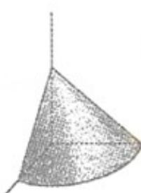
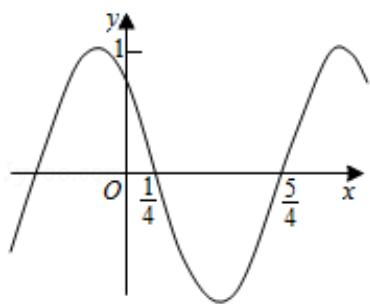
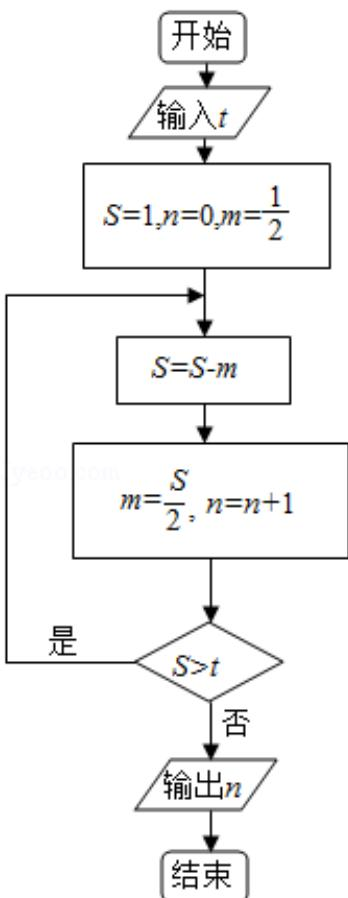
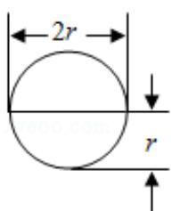

# 2015年全国统一高考数学试卷（文科）（新课标Ⅰ）

项是符合题目要求的.

1. (5 分) 已知集合 $A = \{x \mid x = 3n + 2, n \in \mathbb{N}\}$ , $B = \{6, 8, 10, 12, 14\}$ , 则集合 $A \cap B$ 中元素的个数为（）
A. 5    B. 4    C. 3    D. 2

2. (5分) 已知点 A(0,1), B(3,2), 向量 $\overrightarrow{AC} = (-4, -3)$ , 则向量 $\overrightarrow{BC} = (\quad)$ A. $(-7, -4)$ B. $(7, 4)$ C. $(-1, 4)$ D. $(1, 4)$

3. （5分）已知复数 $z$ 满足 $(z - 1)$ $i = 1 + i$ ，则 $z = (\quad)$ A. -2-i B. -2+i C. 2-i D. $2 + i$

4. (5 分) 如果 3 个正整数可作为一个直角三角形三条边的边长, 则称这 3 个数为一组勾股数. 从 1, 2, 3, 4, 5 中任取 3 个不同的数, 则这 3 个数构成一组勾股数的概率为 ( )

A. $\frac{3}{10}$ B. $\frac{1}{5}$ C. $\frac{1}{10}$ D. $\frac{1}{20}$

5. (5 分) 已知椭圆 E 的中心在坐标原点, 离心率为 $\frac{1}{2}$ , E 的右焦点与抛物线 C: $y^{2} = 8x$ 的焦点重合, A, B 是 C 的准线与 E 的两个交点, 则 $|AB| = (\quad)$

A. 3 B. 6 C. 9 D. 12

6. (5 分)《九章算术》是我国古代内容极为丰富的数学名著, 书中有如下问题: “
今有委米依垣内角, 下周八尺, 高五尺. 问: 积及为米几何? “其意思为: ” 在
屋内墙角处堆放米 (如图, 米堆为一个圆锥的四分之一), 米堆底部的弧长为 8
尺, 米堆的高为 5 尺, 问米堆的体积和堆放的米各为多少? “已知 1 斛米的体
积约为 1.62 立方尺, 圆周率约为 3, 估算出堆放的米约有 ( )

A. 14 斜 B. 22 斜 C. 36 斜 D. 66 斜

7. (5 分) 已知 $\{a_{n}\}$ 是公差为 1 的等差数列, $S_{n}$ 为 $\{a_{n}\}$ 的前 n 项和, 若 $S_{8}=4S_{4}$ , 则 $a_{10}=($ A. $\frac{17}{2}$ B. $\frac{19}{2}$ C. 10 D. 12

8. (5 分) 函数 $f(x) = \cos (\omega x + \varphi)$ 的部分图象如图所示, 则 $f(x)$ 的单调递减区间为
()

A. $(k\pi -\frac{1}{4},k\pi +\frac{3}{4})$ ， $k\in z$ B. $(2k\pi -\frac{1}{4},2k\pi +\frac{3}{4})$ ， $k\in z$ C. $(k - \frac{1}{4},k + \frac{3}{4})$ ， $k\in z$ D. $(2k - \frac{1}{4},2k + \frac{3}{4})$ ， $k\in z$

9. （5分）执行如图所示的程序框图，如果输入的 $t = 0.01$ ，则输出的 $n =$ （）

A. 5 B. 6 C. 7 D. 8

10. (5 分) 已知函数 $f(x) = \begin{cases} 2^{x-1} - 2, & x \leqslant 1 \\ -\log_2(x + 1), & x > 1 \end{cases}$ ，且 $f(a) = -3$ ，则 $f(6 -$ a) = ( )
A. $-\frac{7}{4}$ B. $-\frac{5}{4}$ C. $-\frac{3}{4}$ D. $-\frac{1}{4}$

11. (5 分) 圆柱被一个平面截去一部分后与半球 (半径为 $r$ ) 组成一个几何体, 该几何体三视图中的正视图和俯视图如图所示. 若该几何体的表面积为 $16 + 20\pi$ , 则 $r = (\quad)$

  
正视图

  
俯视图

A. 1 B. 2 C. 4 D. 8

12. (5 分) 设函数 $y = f(x)$ 的图象与 $y = 2^{x + a}$ 的图象关于 $y = -x$ 对称, 且 $f(-2) + f(-4) = 1$ , 则 $a =$ ( )

A. -1 B. 1 C. 2 D. 4

## 二、本大题共4小题，每小题5分.

13. (5 分) 在数列 $\{a_{n}\}$ 中, $a_{1} = 2$ , $a_{n+1} = 2a_{n}$ , $S_{n}$ 为 $\{a_{n}\}$ 的前 $n$ 项和, 若 $S_{n} = 126$ , 则 $n =$

14. (5 分) 已知函数 $f(x) = ax^3 + x + 1$ 的图象在点 (1, f(1)) 处的切线过点 (2, 7), 则 $a =$ \_\_\_\_.

15. （5分）若 $x, y$ 满足约束条件 $\left\{ \begin{array}{l} x + y - 2 \leqslant 0 \\ x - 2y + 1 \leqslant 0 \\ 2x - y + 2 \geqslant 0 \end{array} \right.$ ，则 $z = 3x + y$ 的最大值为 \_\_\_\_.

16. (5 分) 已知 F 是双曲线 C: $x^{2}-\frac{y^{2}}{8}=1$ 的右焦点, P 是 C 的左支上一点, A (0, 6

$\sqrt{6}$ ．当 $\triangle APF$ 周长最小时，该三角形的面积为

![[高中/真题/按年份分类/2015/2015年全国统一高考数学试卷_文科__新课标ⅰ__含解析版_/解答题/解答题.md]]
![[高中/真题/按年份分类/2015/2015年全国统一高考数学试卷_文科__新课标ⅰ__含解析版_/选择题/选择题.md]]
