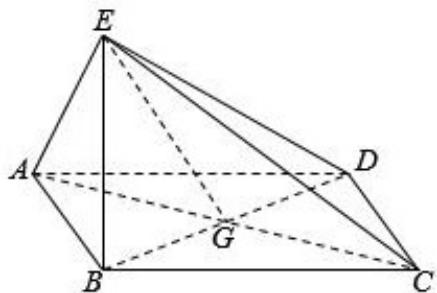

<!-- question-source:start -->
18. (12 分) 如图, 四边形 ABCD 为菱形, G 为 AC 与 BD 的交点, BE⊥平面 ABCD.

（Ⅰ）证明：平面 AEC⊥平面 BED；

（II）若 $\angle ABC = 120^{\circ}$ ，AE⊥EC，三棱锥E-ACD的体积为 $\frac{\sqrt{6}}{3}$ ，求该三棱锥的侧面积.

【考点】LE：棱柱、棱锥、棱台的侧面积和表面积；LY：平面与平面垂直.

【专题】5F：空间位置关系与距离.

【
<!-- question-source:end -->

![[高中/真题/按年份分类/2015/2015年全国统一高考数学试卷_文科__新课标ⅰ__含解析版_/解答题/题目/answers/Q00021806A1.md]]
