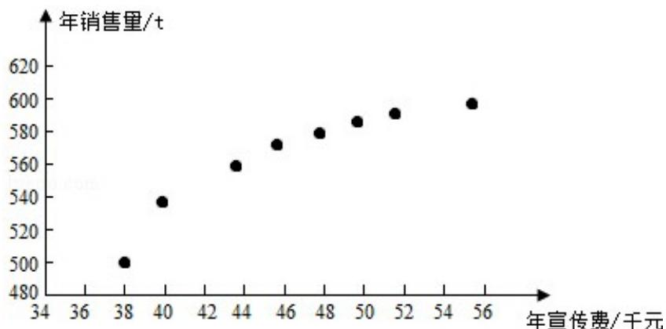

<!-- question-source:start -->
19. （12分）某公司为确定下一年度投入某种产品的宣传费，需了解年宣传费x

(单位: 千元) 对年销售量 y (单位: t) 和年利润 z (单位: 千元) 的影响, 对近 8

年的年宣传费 $x_{i}$ 和年销售量 $y_{i}$ ( $i=1,2,\cdots,8$ ) 数据作了初步处理，得到下面的

散点图及一些统计量的值.

<table><tr><td> $\overline{x}$ </td><td> $\overline{y}$ </td><td> $\overline{w}$ </td><td> $\sum_{i=1}^{8}(x_i - \overline{x})^2$ </td><td> $\sum_{i=1}^{8}(w_i - \overline{w})^2$ </td><td> $\sum_{i=1}^{8}(x_i - \overline{x})(y_i - \overline{y})$ </td><td> $\sum_{i=1}^{8}(w_i - \overline{w})(y_i - \overline{y})$ </td></tr><tr><td>46.6</td><td>563</td><td>6.8</td><td>289.8</td><td>1.6</td><td>1469</td><td>108.8</td></tr></table>

表中 $w_{i} = \sqrt{x_{i}}$ ， $\overline{w} = \frac{1}{8}\sum_{i = 1}^{8}w_{i}$

（Ⅰ）根据散点图判断， $y=a+bx$ 与 $y=c+d\sqrt{x}$ 哪一个适宜作为年销售量 y 关于年宣传费 x 的回归方程类型？（给出判断即可，不必说明理由）

（Ⅱ）根据（Ⅰ）的判断结果及表中数据，建立 y 关于 x 的回归方程；

（III）已知这种产品的年利润 z 与 x、y 的关系为 $z=0.2y-x$ 。根据（II）的结果回答

下列问题:

(i) 年宣传费 $x = 49$ 时，年销售量及年利润的预报值是多少？

(ii) 年宣传费 x 为何值时，年利润的预报值最大？

附：对于一组数据 $(u_{1}v_{1})$ ， $(u_{2}v_{2})\cdots(u_{n}v_{n})$ ，其回归线 $v=\alpha+\beta u$ 的斜率和截距的

最小二乘估计分别为： $\widehat{\beta} = \frac{\sum_{i=1}^{n}(u_i - \overline{u})(v_i - \overline{v})}{\sum_{i=1}^{n}(u_i - \overline{u})^2}, \widehat{\alpha} = \overline{v} - \widehat{\beta} \overline{u}$ .

【考点】BK：线性回归方程.

【专题】51：概率与统计.

【
<!-- question-source:end -->

![[高中/真题/按年份分类/2015/2015年全国统一高考数学试卷_文科__新课标ⅰ__含解析版_/解答题/题目/answers/Q00021807A1.md]]
