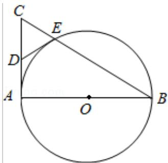

<!-- question-source:start -->
22. （10 分）如图，AB 是 $\odot O$ 的直径，AC 是 $\odot O$ 的切线，BC 交 $\odot O$ 于点 E.

（Ⅰ）若 D 为 AC 的中点，证明：DE 是 $\odot O$ 的切线；

（II）若 $OA=\sqrt{3}CE$ ，求 $\angle ACB$ 的大小.

## 五、【选修4-4：坐标系与参数方程】
<!-- question-source:end -->

![[高中/真题/按年份分类/2015/2015年全国统一高考数学试卷_文科__新课标ⅰ__含解析版_/解答题/题目/answers/Q00027456A1.md]]
