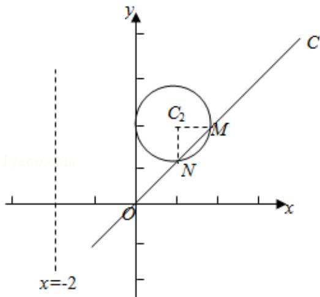

> [!faq]- 2015年全国统一高考数学试卷（文科）（新课标ⅰ）（含解析版）解析
>
> > [!success]- **【答案】** 详见解析
>
> > [!note]- **【分析】**
> > （Ⅰ）由条件根据 $x=\rho\cos\theta$ ， $y=\rho\sin\theta$ 求得 $C_{1}$ ， $C_{2}$ 的极坐标方程.
>
> > [!note]- **【解析】**
> > 分析】（Ⅰ）由条件根据 $x=\rho\cos\theta$ ， $y=\rho\sin\theta$ 求得 $C_{1}$ ， $C_{2}$ 的极坐标方程.
> >
> > （II）把直线 $C_{3}$ 的极坐标方程代入 $\rho^{2}-3\sqrt{2}\rho+4=0$ ，求得 $\rho_{1}$ 和 $\rho_{2}$ 的值，结合圆的半
> >
> > 径可得 $C_{2}M \perp C_{2}N$ ，从而求得 $\triangle C_{2}MN$ 的面积 $\frac{1}{2} \cdot C_{2}M \cdot C_{2}N$ 的值.
> >
> > 【
> > 解答】解：（Ⅰ）由于 $x=\rho\cos\theta,\quad y=\rho\sin\theta,\quad \therefore C_{1}:x=-2$ 的
> >
> > 极坐标方程为 $\rho\cos\theta=-2$ ，
> >
> > 故 $C_{2}$ : $(x - 1)^{2} + (y - 2)^{2} = 1$ 的极坐标方程为：
> >
> > $(\rho\cos\theta - 1)^{2} + (\rho\sin\theta - 2)^{2} = 1,$
> >
> > 化简可得 $\rho^{2}-\left(2\rho\cos\theta+4\rho\sin\theta\right)+4=0.$
> >
> > （II）把直线 $C_3$ 的极坐标方程 $\theta = \frac{\pi}{4}$ （ $\rho \in R$ ）代入
> >
> > 圆 $C_{2}$ : $(x - 1)^{2} + (y - 2)^{2} = 1$ ,
> >
> > 可得 $\rho^{2}-\left(2\rho\cos\theta+4\rho\sin\theta\right)+4=0,$
> >
> > 求得 $\rho_{1}=2\sqrt{2}$ ， $\rho_{2}=\sqrt{2}$ ，
> >
> > $\therefore \left|MN\right| = \left|\rho_{1} - \rho_{2}\right| = \sqrt{2}$ ，由于圆 $C_2$ 的半径为1， $\therefore C_2M\bot C_2N,$
> >
> > $\triangle C_{2}MN$ 的面积为 $\frac{1}{2} \cdot C_{2}M \cdot C_{2}N = \frac{1}{2} \cdot 1 \cdot 1 = \frac{1}{2}$ .
> >
> > 
> >
> > 【点评】本题主要考查简单曲线的极坐标方程，点的极坐标的定义，属于基础题.
> >
> > ##
> > 六、【选修4-5：不等式选讲】
