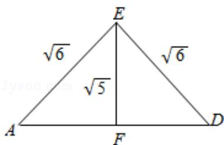

> [!faq]- 2015年全国统一高考数学试卷（文科）（新课标ⅰ）（含解析版）解析
>
> > [!success]- **【答案】** 详见解析
>
> > [!note]- **【分析】**
> > （Ⅰ）根据面面垂直的判定定理即可证明：平面 AEC⊥平面 BED；
>
> > [!note]- **【解析】**
> > 分析】（Ⅰ）根据面面垂直的判定定理即可证明：平面 AEC⊥平面 BED；
> >
> > （Ⅱ）根据三棱锥的条件公式，进行计算即可.
> >
> > 【
> > 解答】证明：（Ⅰ）∵四边形ABCD为菱形，
> >
> > ∴AC⊥BD,
> >
> > ∵BE⊥平面ABCD，
> >
> > ∴AC⊥BE,
> >
> > 则 AC⊥平面 BED，
> >
> > ∵ACC平面AEC，
> >
> > ∴平面 AEC⊥平面 BED;
> >
> > 解：（II）设 AB=x，在菱形 ABCD 中，由 $\angle ABC=120^{\circ}$ ，得 $AG=GC=\frac{\sqrt{3}}{2}x$ ，GB=GD= $\frac{x}{2}$ ，
> >
> > ∵BE⊥平面ABCD，
> >
> > ∴BE⊥BG，则△EBG为直角三角形，
> >
> > $$
> > \therefore E G = \frac {1}{2} A C = A G = \frac {\sqrt {3}}{2} x,
> > $$
> >
> > 则 $BE=\sqrt{EG^{2}-BG^{2}}=\frac{\sqrt{2}}{2}x,$
> >
> > ∵三棱锥 E-ACD 的体积 $V=\frac{1}{3}\times\frac{1}{2}AC\cdot GD\cdot BE=\frac{\sqrt{6}}{24}x^{3}=\frac{\sqrt{6}}{3}$ ,
> >
> > 解得 x=2，即 AB=2，
> >
> > $$
> > \because \angle A B C = 1 2 0 ^ {\circ},
> > $$
> >
> > $$
> > \therefore A C ^ {2} = A B ^ {2} + B C ^ {2} - 2 A B \bullet B C \cos A B C = 4 + 4 - 2 \times 2 \times 2 \times (- \frac {1}{2}) = 1 2,
> > $$
> >
> > 即 $AC=\sqrt{12}=2\sqrt{3}$ ,
> >
> > 在三个直角三角形 EBA，EBD，EBC 中，斜边 AE=EC=ED，
> >
> > ∵AE⊥EC，∴△EAC为等腰三角形，
> >
> > 则 $AE^{2}+EC^{2}=AC^{2}=12$ ，
> >
> > 即 $2AE^{2}=12$ ，
> >
> > $\therefore AE^{2}=6,$
> >
> > 则 $AE=\sqrt{6}$ ,
> >
> > ∴从而得 AE=EC=ED= $\sqrt{6}$ ,
> >
> > ∴△EAC 的面积 $S=\frac{1}{2}\times EA\cdot EC=\frac{1}{2}\times\sqrt{6}\times\sqrt{6}=3$ ,
> >
> > 在等腰三角形 EAD 中，过 E 作 EF⊥AD 于 F，
> >
> > 则 $AE=\sqrt{6}$ ， $AF=\frac{1}{2}AD=\frac{1}{2}\times2=1$ ，
> >
> > 则 $EF=\sqrt{(\sqrt{6})^{2}-1^{2}}=\sqrt{5}$ ,
> >
> > $\therefore \triangle EAD$ 的面积和 $\triangle ECD$ 的面积均为 $S = \frac{1}{2} \times 2 \times \sqrt{5} = \sqrt{5}$ ,
> >
> > 故该三棱锥的侧面积为 $3+2\sqrt{5}$ .
> >
> > 
> >
> > 【点评】本题主要考查面面垂直的判定，以及三棱锥体积的计算，要求熟练掌握相
> >
> > 应的判定定理以及体积公式.
