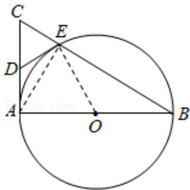

> [!faq]- 2015年全国统一高考数学试卷（文科）（新课标ⅰ）（含解析版）解析
>
> > [!success]- **【答案】** 详见解析
>
> > [!note]- **【分析】**
> > （Ⅰ）连接 AE 和 OE，由三角形和圆的知识易得 $\angle OED=90^{\circ}$ ，可得 DE 是 $\odot O$
>
> > [!note]- **【解析】**
> > 分析】（Ⅰ）连接 AE 和 OE，由三角形和圆的知识易得 $\angle OED=90^{\circ}$ ，可得 DE 是 $\odot O$
> >
> > 的切线；
> >
> > （II）设 $CE = 1, AE = x$ ，由射影定理可得关于 $x$ 的方程 $x^{2} = \sqrt{12 - x^{2}}$ ，解方程可得 $x$ 值，
> >
> > 可得所求角度.
> >
> > 【
> > 解答】解：（Ⅰ）连接 AE，由已知得 AE⊥BC，AC⊥AB，
> >
> > 在 RT△ABC 中，由已知可得 DE=DC，∴∠DEC=∠DCE，
> >
> > 连接 OE，则 $\angle OBE = \angle OEB$ ，
> >
> > 又 $\angle ACB+\angle ABC=90^{\circ}$ ， $\therefore \angle DEC+\angle OEB=90^{\circ}$ ，
> >
> > $\therefore\angle OED=90^{\circ},\therefore DE$ 是 $\odot O$ 的切线;
> >
> > （Ⅱ）设 CE=1，AE=x，
> >
> > 由已知得 $AB=2\sqrt{3}$ ， $BE=\sqrt{12-x^{2}}$ ，
> >
> > 由射影定理可得 $AE^{2}=CE\bullet BE$ ，
> >
> > $\therefore x^{2} = \sqrt{12 - x^{2}}$ ，即 $x^4 +x^2 -12 = 0$
> >
> > 解方程可得 $x = \sqrt{3}$
> >
> > $$
> > \therefore \angle A C B = 6 0 ^ {\circ}
> > $$
> >
> > 
> >
> > 【点评】本题考查圆的切线的判定，涉及射影定理和三角形的知识，属基础题.
> >
> > 五、【选修4-4：坐标系与参数方程】
