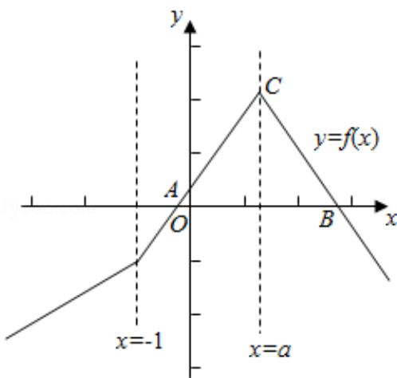

> [!faq]- 2015年全国统一高考数学试卷（文科）（新课标ⅰ）（含解析版）解析
>
> > [!success]- **【答案】** 详见解析
>
> > [!note]- **【分析】**
> > （Ⅰ）当 a=1 时，把原不等式去掉绝对值，转化为与之等价的三个不等式
>
> > [!note]- **【解析】**
> > 解：（Ⅰ）当 a=1 时，不等式 f(x) >1，即 $\left|x+1\right| - 2\left|x-1\right| >1$ ，
> >
> > 即 $\left\{\begin{aligned}x&<-1\\ -x-1-2(1-x)&>1\end{aligned}\right.$ ①，或 $\left\{\begin{aligned}-1&\leqslant x<1\\ x+1-2(1-x)&>1\end{aligned}\right.$ ②，
> >
> > 或 $\left\{\begin{aligned}x&\geqslant1\\ x+1-2(x-1)&>1\end{aligned}\right.$ ③.
> >
> > 解①求得 $x \in \emptyset$ ，解②求得 $\frac{2}{3} < x < 1$ ，解③求得 $1 \leq x < 2$ .
> >
> > 综上可得，原不等式的解集为 $\left(\frac{2}{3}, 2\right)$ 。
> >
> > （Ⅱ）函数 $f(x) = |x + 1| - 2|x - a| = \begin{cases} x - 1 - 2a, & x < -1 \\ 3x + 1 - 2a, & -1 \leqslant x \leqslant \varepsilon, \\ -x + 1 + 2a, & x > a \end{cases}$
> >
> > 由此求得 $f(x)$ 的图象与 $x$ 轴的交点 $A(\frac{2a-1}{3}, 0)$ ，
> >
> > B $(2a+1, 0)$ ,
> >
> > 故 $f(x)$ 的图象与x轴围成的三角形的第三个顶点C（a，a+1），
> >
> > 由 $\triangle ABC$ 的面积大于6，
> >
> > 可得 $\frac{1}{2} [2a + 1 - \frac{2a - 1}{3}] \cdot (a + 1) > 6$ ，求得 $a > 2$ .
> >
> > 故要求的 a 的范围为 $(2, +\infty)$ .
> >
> > 
> >
> > 【点评】本题主要考查绝对值不等式的解法，体现了转化、分类讨论的数学思想，
> >
> > 属于中档题.
