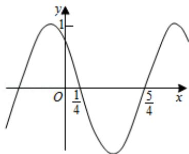

<!-- question-source:start -->
8. (5 分) 函数 $f(x) = \cos (\omega x + \varphi)$ 的部分图象如图所示, 则 $f(x)$ 的单调递减区间为

( )

A. $(k\pi - \frac{1}{4}, k\pi + \frac{3}{4})$ ， $k \in z$ B. $(2k\pi - \frac{1}{4}, 2k\pi + \frac{3}{4})$ ， $k \in z$

C. $(k - \frac{1}{4}, k + \frac{3}{4})$ ， $k \in z$

D. $(2k - \frac{1}{4}, 2k + \frac{3}{4})$ , $k \in z$

【考点】HA：余弦函数的单调性.

【专题】57：三角函数的图像与性质.

【
<!-- question-source:end -->

![[高中/真题/按年份分类/2015/2015年全国统一高考数学试卷_文科__新课标ⅰ__含解析版_/选择题/题目/answers/Q00021796A1.md]]
