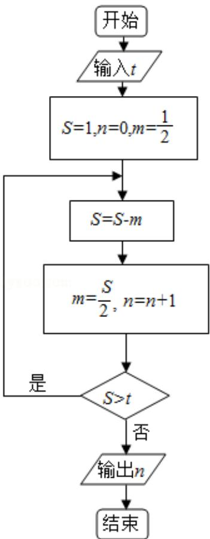

<!-- question-source:start -->
9. （5 分）执行如图所示的程序框图，如果输入的 t=0.01，则输出的 n=（）

A. 5 B. 6 C. 7 D. 8

【考点】EF：程序框图.

【专题】5K：算法和程序框图.

【
<!-- question-source:end -->

![[高中/真题/按年份分类/2015/2015年全国统一高考数学试卷_文科__新课标ⅰ__含解析版_/选择题/题目/answers/Q00021797A1.md]]
