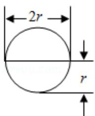
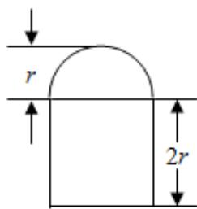

<!-- question-source:start -->
11. (5 分) 圆柱被一个平面截去一部分后与半球 (半径为 $r$ ) 组成一个几何体, 该几何体三视图中的正视图和俯视图如图所示. 若该几何体的表面积为 $16 + 20\pi$ , 则 $r = (\quad)$

  
正视图

  
俯视图

A. 1 B. 2 C. 4 D. 8

【考点】L!：由三视图求面积、体积.

【专题】5Q：立体几何.

【
<!-- question-source:end -->

![[高中/真题/按年份分类/2015/2015年全国统一高考数学试卷_文科__新课标ⅰ__含解析版_/选择题/题目/answers/Q00021799A1.md]]
