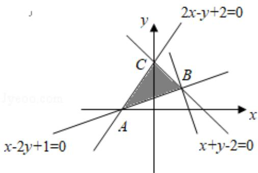

> [!faq]- 2015年全国统一高考数学试卷（文科）（新课标ⅰ）（含解析版）解析
>
> > [!success]- **【答案】** . 【
>
> > [!note]- **【分析】**
> > 由约束条件作出可行域，化目标函数为直线方程的斜截式，数形结合得到
>
> > [!note]- **【解析】**
> > 分析】由约束条件作出可行域，化目标函数为直线方程的斜截式，数形结合得到
> >
> > 最优解，代入最优解的坐标得
> > 答案.
> >
> > 【
> > 解答】解：由约束条件 $\left\{\begin{aligned}x+y-2&\leqslant0\\ x-2y+1&\leqslant0\\ 2x-y+2&\geqslant0\end{aligned}\right.$ 作出可行域如图，
> >
> > 
> >
> > 化目标函数 $z=3x+y$ 为 $y=-3x+z$ ,
> >
> > 由图可知，当直线 $y = -3x + z$ 过 B（1，1）时，直线在 y 轴上的截距最大，
> >
> > 此时 z 有最大值为 $3 \times 1 + 1 = 4$ .
> >
> > 故
> > 答案为：4.
> >
> > 【点评】本题考查简单的线性规划，考查了数形结合的解题思想方法，是中档题.
