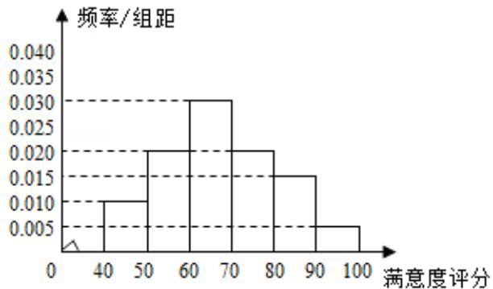
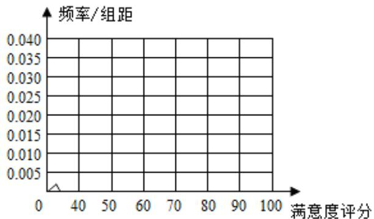

<!-- question-source:start -->
18. 某公司为了解用户对其产品的满意度，从A，B两地区分别随机调查了40个

用户, 根据用户对产品的满意度评分, 得到 A 地区用户满意度评分的频率分布

直方图和 B 地区用户满意度评分的频数分布表

A地区用户满意度评分的频率分布直方图  

B地区用户满意度评分的频率分布直方图

B 地区用户满意度评分的频数分布表

<table><tr><td>满意度评分分组</td><td>[50, 60)</td><td>[60, 70)</td><td>[70, 80)</td><td>[80, 90)</td><td>[90, 100)</td></tr><tr><td>频数</td><td>2</td><td>8</td><td>14</td><td>10</td><td>6</td></tr></table>
<!-- question-source:end -->

![[高中/真题/按年份分类/2015/2015年全国统一高考数学试卷_文科__新课标ⅱ__含解析版_/填空题/题目/answers/Q00028365A1.md]]
