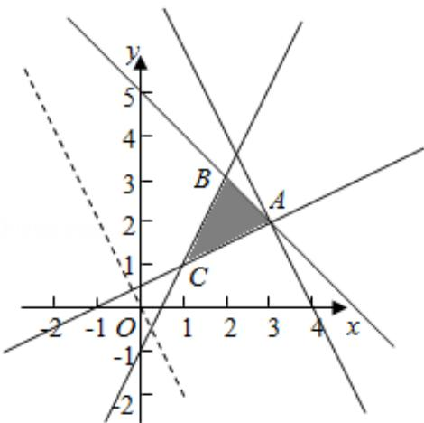

> [!faq]- 2015年全国统一高考数学试卷（文科）（新课标ⅱ）（含解析版）解析
>
> > [!success]- **【答案】** 8
>
> > [!note]- **【分析】**
> > 作出不等式组对应的平面区域, 利用目标函数的几何意义, 利用数形结合
>
> > [!note]- **【解析】**
> > 解：作出不等式组对应的平面区域如图：（阴影部分ABC）.
> >
> > 由 $z = 2x + y$ 得 $y = -2x + z$
> >
> > 平移直线 $y = -2x + z$ ,
> >
> > 由图象可知当直线 $y = -2x + z$ 经过点 A 时，直线 $y = -2x + z$ 的截距最大，
> >
> > 此时 z 最大.
> >
> > 由 $\left\{\begin{aligned}x+y-5&=0\\ x-2y+1&=0\end{aligned}\right.$ ，解得 $\left\{\begin{aligned}x&=3\\ y&=2\end{aligned}\right.$ ，即A(3,2)
> >
> > 将 A（3，2）的坐标代入目标函数 $z=2x+y$ ，
> >
> > 得 $z = 2 \times 3 + 2 = 8$ 。即 $z = 2x + y$ 的最大值为 8.
> >
> > 故答案为：8.
> >
> > 
> >
> > 【点评】本题主要考查线性规划的应用, 结合目标函数的几何意义, 利用数形结合
> >
> > 的数学思想是解决此类问题的基本方法.
