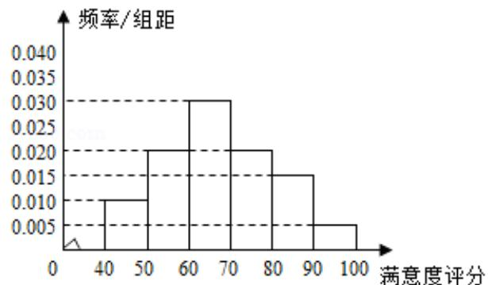
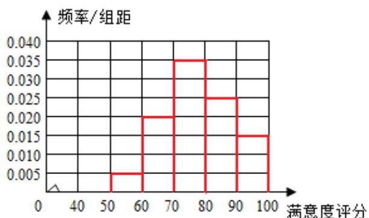

> [!faq]- 2015年全国统一高考数学试卷（文科）（新课标ⅱ）（含解析版）解析
>
> > [!success]- **【答案】** 0^{\circ} - (\angle BAC + \angle B)$ ，两边取正弦后展开两角和的正弦，再结合（I）
>
> > [!note]- **【分析】**
> > （Ⅰ）根据分布表的数据，画出频率直方图，求解即可.
>
> > [!note]- **【解析】**
> > 解：（Ⅰ）
> >
> > A地区用户满意度评分的频率分布直方图
> >
> >   
> > B地区用户满意度评分的频率分布直方图
> >
> >   
> > 通过两个地区用户满意度评分的频率分布直方图可以看出，B 地区用户满意度评
> >
> > 分的平均值高于 A 地区用户满意度评分的平均值，
> >
> > B 地区的用户满意度评分的比较集中，而 A 地区的用户满意度评分的比较分散.
> >
> > (II) A 地区用户的满意度等级为不满意的概率大.
> >
> > 记 $C_{A}$ 表示事件：“A 地区用户的满意度等级为不满意”， $C_{B}$ 表示事件：“B 地区用
> >
> > 户的满意度等级为不满意”，
> >
> > 由直方图得 $P(C_{A}) = (0.01 + 0.02 + 0.03) \times 10 = 0.6$
> >
> > 得 $P(C_{B}) = (0.005 + 0.02) \times 10 = 0.25$
> >
> > ∴A 地区用户的满意度等级为不满意的概率大.
