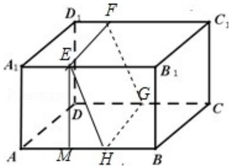

> [!faq]- 2015年全国统一高考数学试卷（文科）（新课标ⅱ）（含解析版）解析
>
> > [!success]- **【答案】** 详见解析
>
> > [!note]- **【分析】**
> > （Ⅰ）利用平面与平面平行的性质，可在图中画出这个正方形；
>
> > [!note]- **【解析】**
> > 分析】（Ⅰ）利用平面与平面平行的性质，可在图中画出这个正方形；
> >
> > （II）求出 $MH=\sqrt{EH^{2}-EM^{2}}=6$ , AH=10, HB=6，即可求平面 a 把该长方体分成的两部
> >
> > 分体积的比值.
> >
> > 【
> > 解答】解：（Ⅰ）交线围成的正方形 EFGH 如图所示；
> >
> > （II）作 EM⊥AB，垂足为 M，则 AM=A₁E=4，EB₁=12，EM=AA₁=8.
> >
> > 因为 EFGH 为正方形，所以 EH=EF=BC=10，
> >
> > 于是 $MH=\sqrt{EH^{2}-EM^{2}}=6,\ AH=10,\ HB=6.$
> >
> > 因为长方体被平面 $\alpha$ 分成两个高为 10 的直棱柱，
> >
> > 所以其体积的比值为 $\frac{9}{7}$ .
> >
> > 
> >
> > 【点评】本题考查平面与平面平行的性质，考查学生的计算能力，比较基础.
