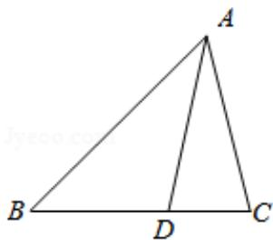

> [!faq]- 2015年全国统一高考数学试卷（文科）（新课标ⅱ）（含解析版）解析
>
> > [!success]- **【答案】** 为：8. 【点评】本题考查导数的运用：求切线方程，主要考查导数的几何意义：函数在某 点处的导数即为曲线在该点处的导数，设出切线方程运用两线相切的性质是 解题的关键. ## 三．解答题 17. $\triangle ABC$ 中, $D$ 是 $BC$ 上的点, $AD$ 平分 $\angle BAC$ , $BD = 2DC$ (Ⅰ) 求 $\frac{\sin\angle B}{\sin\angle C}$ . （II）若 $\angle BAC = 60^{\circ}$ ，求∠B. 【考点】HP：正弦定理. 【专题】58：解三角形. 【
>
> > [!note]- **【分析】**
> > 求出 $y=x+\ln x$ 的导数, 求得切线的斜率, 可得切线方程, 再由于切线与曲线
>
> > [!note]- **【解析】**
> > 分析】求出 $y=x+\ln x$ 的导数, 求得切线的斜率, 可得切线方程, 再由于切线与曲线
> >
> > $y=ax^{2}+(a+2)x+1$ 相切，有且只有一切点，进而可联立切线与曲线方程，根据 $\triangle$
> >
> > =0 得到 a 的值.
> >
> > 【
> > 解答】解： $y = x + \ln x$ 的导数为 $y' = 1 + \frac{1}{x}$ ，
> >
> > 曲线 $y=x+\ln x$ 在 x=1 处的切线斜率为 k=2，
> >
> > 则曲线 $y=x+\ln x$ 在 x=1 处的切线方程为 y-1=2x-2，即 y=2x-1.
> >
> > 由于切线与曲线 $y=ax^{2}+(a+2)x+1$ 相切，
> >
> > 故 $y=ax^{2}+(a+2)x+1$ 可联立 y=2x-1,
> >
> > 得 $ax^{2}+ax+2=0$ ，
> >
> > 又 $a = 0$ ，两线相切有一切点，
> >
> > 所以有 $\triangle=a^{2}-8a=0$ ，
> >
> > 解得 a=8.
> >
> > 故
> > 答案为：8.
> >
> > 【点评】本题考查导数的运用：求切线方程，主要考查导数的几何意义：函数在某
> >
> > 点处的导数即为曲线在该点处的导数，设出切线方程运用两线相切的性质是
> >
> > 解题的关键.
> >
> > ## 三．解答题
> >
> > 17. $\triangle ABC$ 中, $D$ 是 $BC$ 上的点, $AD$ 平分 $\angle BAC$ , $BD = 2DC$
> >
> > (Ⅰ) 求 $\frac{\sin\angle B}{\sin\angle C}$ .
> >
> > （II）若 $\angle BAC = 60^{\circ}$ ，求∠B.
> >
> > 【考点】HP：正弦定理.
> >
> > 【专题】58：解三角形.
> >
> > 【
> > 分析】（Ⅰ）由题意画出图形，再由正弦定理结合内角平分线定理得
> > 答案；
> >
> > （II）由 $\angle C = 180^{\circ} - (\angle BAC + \angle B)$ ，两边取正弦后展开两角和的正弦，再结合（I）
> >
> > 中的结论得
> > 答案.
> >
> > 【
> > 解答】解：（Ⅰ）如图，
> >
> > 由正弦定理得:
> >
> > $$
> > \frac {\mathrm{AD}}{\sin \angle B} = \frac {\mathrm{BD}}{\sin \angle \mathrm{BAD}}, \frac {\mathrm{AD}}{\sin \angle C} = \frac {\mathrm{DC}}{\sin \angle \mathrm{CAD}},
> > $$
> >
> > ∵AD 平分∠BAC，BD=2DC，
> >
> > $$
> > \therefore \frac {\sin \angle B}{\sin \angle C} = \frac {D C}{B D} = \frac {1}{2};
> > $$
> >
> > (II) $\because \angle C=180^{\circ}-\left(\angle BAC+\angle B\right)$ ， $\angle BAC=60^{\circ}$
> >
> > $$
> > \therefore \sin \angle C = \sin (\angle B A C + \angle B) = \frac {\sqrt {3}}{2} \cos \angle B + \frac {1}{2} \sin \angle B,
> > $$
> >
> > 由（Ⅰ）知 $2\sin\angle B=\sin\angle C$ ,
> >
> > $\therefore \tan \angle B = \frac{\sqrt{3}}{3}$ ，即 $\angle B = 30^{\circ}$ 。
> >
> > 
> >
> > 【点评】本题考查了内角平分线的性质，考查了正弦定理的应用，是中档题.
